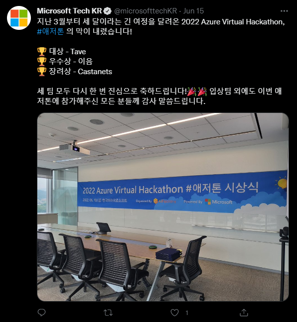
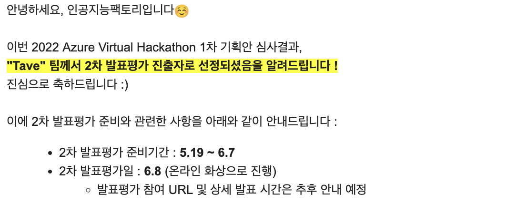
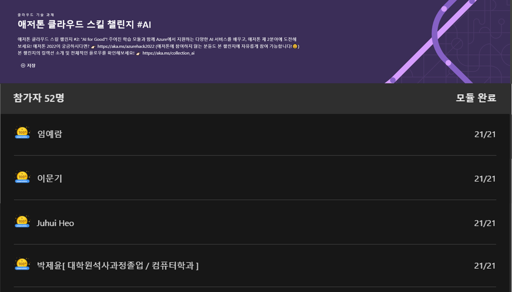
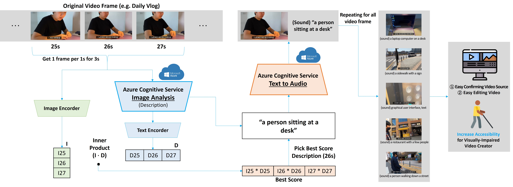
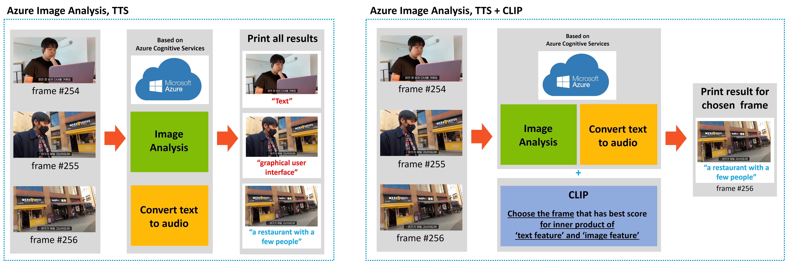

# Azure-Virtual-Hackathon-2022

## 🏆 Finals

## ✨ Semifinals

## 🏃🏻‍♂️ Cloud Skills Challenge (9/52 = 17.3%, Track 2)

## 🧑🏻‍💻 People

- Team TAVE: 
    - [Yeram](https://itwithruilan.tistory.com/), [Moongi](https://blog.naver.com/ansrl23), [Juhui](https://heojuhuigitblog.netlify.app/), [Jeiyoon](https://jeiyoon.github.io/)  

## System Architecture

## Demo

https://user-images.githubusercontent.com/56618962/172107585-b0be6c83-4972-49d0-903d-ec1e6edc699b.mp4

https://user-images.githubusercontent.com/56618962/172105272-cd02866a-f0c1-449d-a680-a1cf555be286.mp4

## 👩🏻‍💻 Duration
- 2022.04.16 ~ 2022.06.08 (54 days)

## 🗓 Schedule
|일정|날짜|
|:-----:|:-----:|
|참가 접수 및 1차 서류 접수 기간|05.13 금 (23:59까지) [✔]
|1차 서류심사 결과 발표|~~05.18 수~~ 05.19 목 [✔]| 
|2차 발표 자료 제출|06.06 월 20시 [✔]|
|2차 발표 평가 (온라인 진행 예정)|06.08 수 [✔]|
|시상식 (한국 마이크로소프트 11층 에펠룸)|06.10 금 [✔]|

## 🗣 Criteria
- 이번 대회는 3개 분야에 대하여 동일한 심사 기준을 적용하여 통합적인 평가를 실시합니다.
- 각 단계별 심사 기준은 아래와 같습니다.
    

- 2차 발표평가 (60%) - (2차 발표평가 심사기준의 세부 내용은 추후 변경될 수 있음을 안내드립니다)

|평가 항목|평가 내용|배점|
|:---:|:---:|:---:|
|파급 효과|지속발전 및 성장가능성, 사회적 가치창출 및 파급효과|40|
|애저 활용성|아이디어와 연계하여 애저 활용 방안|30|
|완성도|아이디어와 문제 주제의 연관성 및 설득력|20|
|실현 가능성|아이디어 고도화 및 실현 가능성 등|10|

- 1차 서류심사 (40%) : 1차 서류 심사에서 동점자가 발생할 경우 아래 심사기준에서 배점이 큰 항목에서 고득점을 기준으로 순위를 판가름 합니다.

|평가 항목|평가 내용|배점|
|:---:|:---:|:---:|
|실현 가능성|추후 고도화 및 실현 가능성 등|20|
|창의성|제안하는 아이디어(기술)의 혁신성 및 진보성 등|30|
|주제 연관성|선택한 분야 및 과제와의 주제 연관성|20|
|애저 활용성|제안하는 아이디어(기술)와 연계된 애저 활용도|30|

## 📢 Presentation
- 발표 시간
    - 1개 팀 당 발표 15분, 질의응답 5분으로 구성
    - 팀 별 상세 발표 타임 테이블은 추후 안내 예정
- 발표 자료 
    - 1차 기획안을 토대로 ppt/ pdf 자료를 제작하여 발표 진행
    - 자유 양식 (정해진 서식 없음)
    - 시연에 필요한 부가 자료가 있을 경우 함께 준비
    - 발표 시간이 15분이라는 점을 감안하여 부가자료를 준비해주시길 바랍니다.
- 발표자료 제출 기한
    - 6월 6일 오후 20:00까지 발표 자료 선 제출
    - 글씨체 깨짐 등의 문제를 방지하기 위하여 가급적 pdf 파일로 변환하여 제출할 것을 제안드립니다. 

## 🌘 Discord

Thank you for registering.

There are two steps to complete the registration 
1) Please join our discord channel at
https://discord.gg/S6w2Wey2cz
2) Join the Challenge using-https://aka.ms/csckr_ai

Please complete above steps, where we all can learn together and also have Azure experts and people from Microsoft who can assist you while learning.

### 👑 More About

- [AI Factory page](https://aifactory.space/competition/detail/2005)
- [Team Notion](https://bedecked-engine-838.notion.site/2022-Azure-Virtual-Hackathon-a75ab41fef2f4fed9f2f6e49dbf40c75)
- Baselines:
    - https://docs.microsoft.com/ko-KR/azure/search/search-get-started-python
    - https://docs.microsoft.com/ko-KR/azure/cognitive-services/big-data/samples-python

### 📚 Reference
- [2021 Azure HACKATHON](https://azureai.devpost.com/project-gallery?page=1)
- [Build Pipeline](https://docs.microsoft.com/ko-kr/azure/architecture/reference-architectures/ai/speech-to-text-transcription-pipeline)
- [Azure image classification](https://docs.microsoft.com/ko-kr/azure/architecture/example-scenario/ai/intelligent-apps-image-processing)
- [Loading videos](https://video-dataset-loading-pytorch.readthedocs.io/en/latest/)

