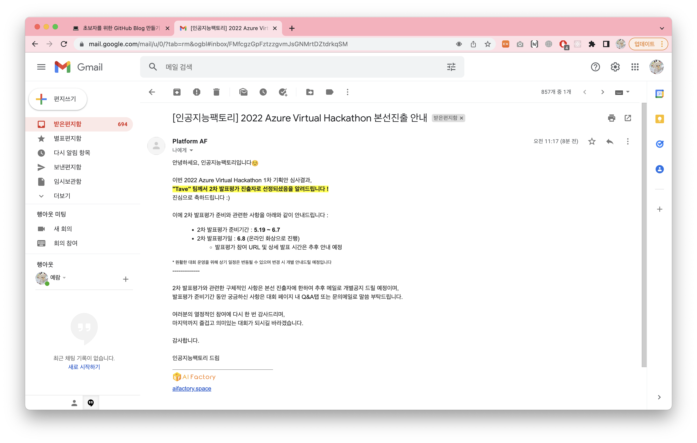

# Azure-Virtual-Hackathon-2022

- Semifinal

- Cloud Skills Challenge

## 🧑🏻‍💻 People
|Name|Role|
|:-----:|:----:|
|[Yeram](https://itwithruilan.tistory.com/)|Lead, Azure|
|[Moongi](https://blog.naver.com/ansrl23)|Deep Leearning|
|[Juhui](https://heojuhuigitblog.netlify.app/)|Azure|
|[Jeiyoon](https://jeiyoon.github.io/)|Deep Learning|

## 👩🏻‍💻 Duration
- 2022.04.16 ~ 

## 🗓 Schedule
|일정|날짜|
|:-----:|:-----:|
|참가 접수 및 1차 서류 접수 기간|05.13 금 (23:59까지) [✔]
|1차 서류심사 결과 발표|~~05.18 수~~ 05.19 목 [✔]| 
|2차 발표 평가 (온라인 진행 예정)|06.08 수|
|시상식 (온라인 진행 예정)|06.10 금|

## 🗣 Criteria
- 이번 대회는 3개 분야에 대하여 동일한 심사 기준을 적용하여 통합적인 평가를 실시합니다.
- 각 단계별 심사 기준은 아래와 같습니다.
<!--     - 1차 서류심사 (40%) : 1차 서류 심사에서 동점자가 발생할 경우 아래 심사기준에서 배점이 큰 항목에서 고득점을 기준으로 순위를 판가름 합니다.

    |평가 항목|평가 내용|배점|
    |:---:|:---:|:---:|
    |실현 가능성|추후 고도화 및 실현 가능성 등|30|
    |창의성|제안하는 아이디어(기술)의 혁신성 및 진보성 등|20|
    |주제 연관성|선택한 분야 및 과제와의 주제 연관성|20|
    |애저 활용성|제안하는 아이디어(기술)와 연계된 애저 활용도|30| -->

- 2차 발표평가 (60%) - (2차 발표평가 심사기준의 세부 내용은 추후 변경될 수 있음을 안내드립니다)

|평가 항목|평가 내용|배점|
|:---:|:---:|:---:|
|실현 가능성|추후 고도화 및 실현 가능성 등|25|
|완성도|아이디어(기술)의 개발 완성도 및 설득력|25|
|파급 효과|지속발전 및 성장가능성, 사회적 가치창출 및 파급효과|25|
|애저 활용성|제안하는 아이디어(기술)와 연계된 애저 활용도|25|

<!-- ### 웹페이지

### 데모영상

### 출연연 데이터 목록

### 외부 데이터 목록 -->

### More About

- [page](https://aifactory.space/competition/detail/2005)
- [notion](https://bedecked-engine-838.notion.site/2022-Azure-Virtual-Hackathon-a75ab41fef2f4fed9f2f6e49dbf40c75)

### Reference
- [2021 Azure HACKATHON](https://azureai.devpost.com/project-gallery?page=1)
- [Build Pipeline](https://docs.microsoft.com/ko-kr/azure/architecture/reference-architectures/ai/speech-to-text-transcription-pipeline)
- [Azure image classification](https://docs.microsoft.com/ko-kr/azure/architecture/example-scenario/ai/intelligent-apps-image-processing)
- [Loading videos](https://video-dataset-loading-pytorch.readthedocs.io/en/latest/)

